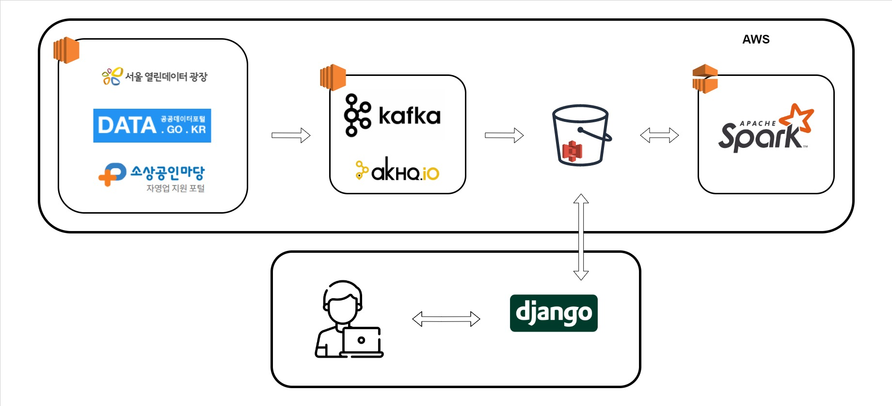
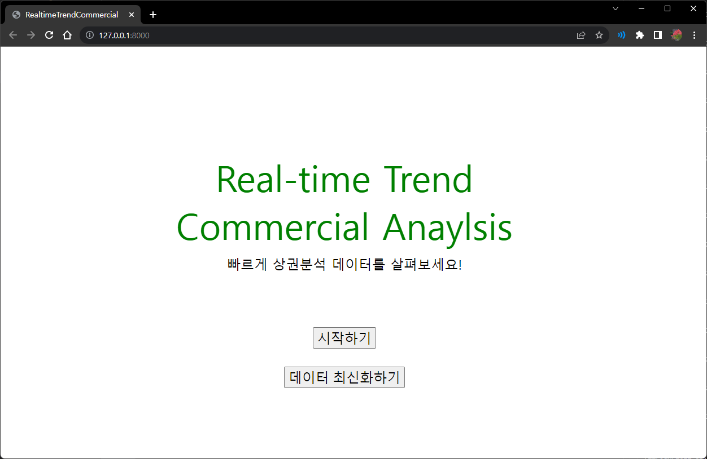
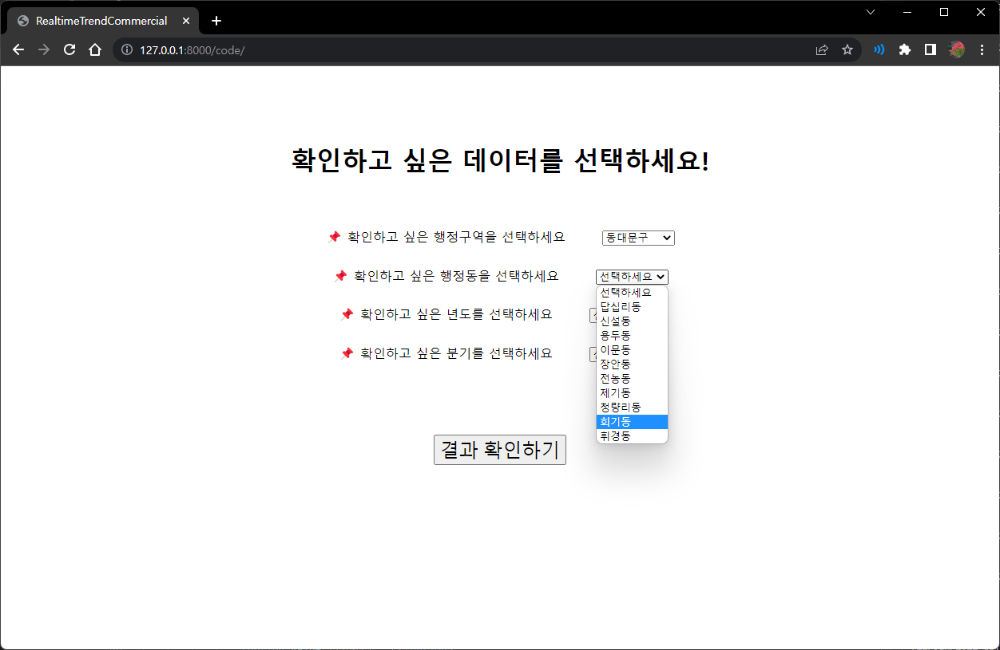
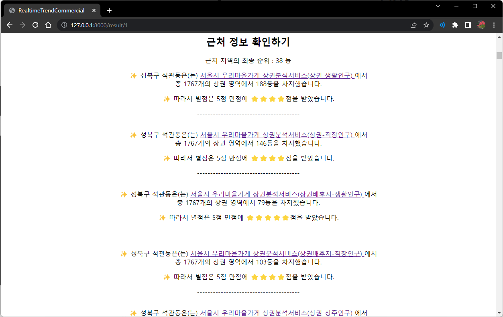
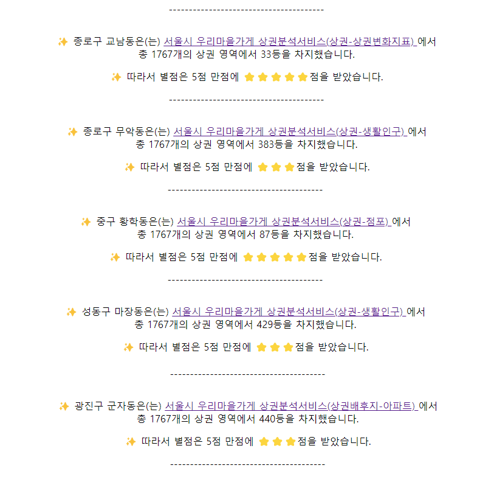
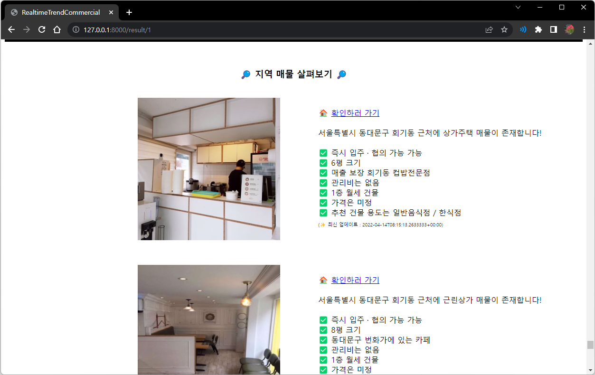

# Real-time Trend Commercial Analysis
2022년 1학기 캡스톤디자인1 프로젝트

### 🧑‍💻 구성원
이름 | 학과 |  학번  | 이메일 | Github
------------ | -------------  | ------------- | -------------  | ------------- 
이창렬 | 컴퓨터공학과 | 2019110634 | lclgood@khu.ac.kr | [Github Link](https://github.com/SteveArseneLee)
허인경 | 컴퓨터공학과 | 2019102241 |  red131729@khu.ac.kr | [Github Link](https://github.com/satelliteheart)

## 🔖 주제
RTC는 예비 창업자에게 필수적인 위치 정보를 종합적으로 보여줄 수 있는 소프트웨어로 상권 정보, 접근성, 인기도를 토대로 사용자가 선택한 지역이 사용자의 창업 취지에 적합한 곳인지 알려준다.

## 📑 프로젝트 소개
분산되어 있는 대용량 비정형 데이터를 Kafka를 이용하여 S3에 저장한 후, Spark를 통해 빅데이터 연산을 진행하는 데이터 레이크를 구축한다. 
연산이 완료된 데이터에 쉽게 접근하기 위해 사용자는 Django를 데이터를 요청하고 시각화된 결과물을 확인할 수 있다.

### 📋 Project Introduction
As a service for **prospective entrepreneurs**, it is a service that informs which business is suitable for a certain location before starting a business. It collects and refines a large amount of information required from various open API sites, and the information comes out when the user selects a location.

### 🔎 프로젝트 구조도
프로젝트 구조도를 간단하게 묘사하면 다음 사진과 같다.

    

### 🗃️ Development Environment
- Apache Kafka on AWS EC2
- Apache Spark on AWS EMR
- Django
- AWS S3

### ⛓️ 프로젝트 흐름

1. 스케쥴러가 Kafka를 실행시켜 주기적으로 데이터를 수집한다. 이 데이터들은 데이터가 사용 준비 상태가 될 때까지 원시 상태로 보관된다.
2. Spark는 데이터에 접근하여 연산에 필요한 데이터를 정제한 후, 분석 레포트를 생성한다.
3. 분석 레포트는 매일 갱신된다.
4. 사용자는 Django을 통해 얻고 싶은 정보를 획득한다.

## 🖼️ 시연 화면

첫 화면에는 시작할 수 있는 버튼과 데이터를 최신화할 수 있는 버튼이 있다. 데이터 최신화하기 버튼을 클릭하면 API를 호출하여 새로운 데이터를 가져오는 과정을 시작한다.

    

확인하고 싶은 행정구역을 선택한 후, 행정구역 안에 있는 행정동과 년도, 분기를 차례대로 입력한다.

    

결과 화면에서는 최종 창업 추천 순위와 함께 지정 상권 여부를 알려주고 창업에 관련된 주제를 기본으로 어떠한 순위를 받았는지 보여준다.

    

동시에 근처 행정구역들의 정보를 보여준다.

    
    

마지막으로 선택한 행정동에 존재하는 상권 매물들에 대한 정보를 보여준다.

    

